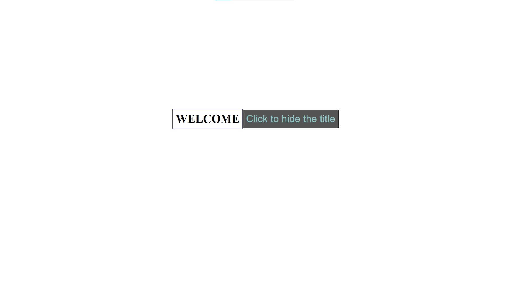

# JS learning files

I'm gonna use this repository to study JS and its related functions.
For future reference I'll try to create a documentation with clear uses and scenarios

1st commit - i was just trying to create a simple button and a title that would dynamically change after a click.

